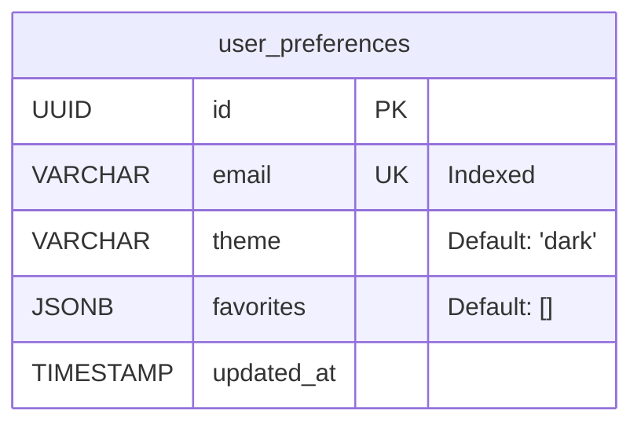

# Low-Level Design (LLD) - GenAI Workspace & Admin Platform

## 1. Folder Structure
```
/backend            # FastAPI backend logic
  /auth             # Authentication strategies and dependencies
  /routes           # API routes
  /models           # Pydantic models
  /data             # JSON data storage
  /utils            # Utility functions
  main.py           # FastAPI application entry point
  config.py         # Configuration settings
/src
  /modules
    /workspace      # User-facing module
      /components   # Workspace-specific components
      /pages        # Workspace pages
      /services     # Workspace-specific API logic
    /admin          # Admin dashboard module
      /components   # Admin-specific components
      /services     # Admin-specific API logic
  /shared           # Shared resources
    /components     # Reusable UI components (Button, Modal, Toast)
    /context        # Global contexts (Auth, Preferences)
    /services       # Shared API logic
  App.tsx           # Main application router
  main.tsx          # Application entry point
```

## 2. Component Hierarchy

### 2.1 Main Application (`App.tsx`)
- **Providers**: `AuthProvider`, `PreferencesProvider`
- **Router**: `BrowserRouter`
  - **Route**: `/workspace/*` -> `WorkspaceModule`
  - **Route**: `/admin/*` -> `RequireAdmin` -> `AdminModule`

### 2.2 Workspace Module (`WorkspaceModule.tsx`)
- **Layout**: `SidebarNavigation` (Fixed, Collapsible), `Header` (Sticky), `MainContent` (Scrollable)
- **Main Content Layout**: `ml-[72px]` to offset for the collapsed sidebar width.
- **Background**: Ambient gradient + Animated blobs
- **State**: `searchQuery`, `viewMode`, `activeFilter`, `activeCategory`

### 2.3 Navigation System (`SidebarNavigation.tsx`)
- **Structure**: Vertical layout with Home, Favorites, and a dynamic list of Categories.
- **Collapsing Behavior**:
  - **Collapsed**: 72px width, shows icons only with tooltips on hover.
  - **Expanded**: 240px width, expands on hover to show full text labels.
  - **Animation**: `framer-motion` handles the width transition smoothly.
- **Active Indicator**: A vertical bar on the left highlights the active navigation item.

### 2.4 Card Surface (`CardSurfaceContainer.tsx`)
- **Effect**: Mouse-following radial gradient highlight layer behind the grid.
- **Performance**: Uses `framer-motion` for optimized opacity transitions.

### 2.5 Scroll Optimization
- **Container**: `overflow-y-auto` on main content div.
- **Scrollbar**: Hidden via CSS (`no-scrollbar` utility) but functional.
- **Behavior**: Prevents body scroll, ensuring only the content area scrolls.

### 2.4 Card Interaction Layer (`AppItem.tsx`)
- **Motion**: Uses `framer-motion` for staggered entry (`delay: index * 0.05`).
- **Hover State**: 
  - `translate-y` (-4px)
  - `shadow-xl` (custom dark mode shadow)
  - `border-slate-500/40`
- **Glow**: Absolute positioned `div` with `inset-[-1px]`, `blur-md`, and category-specific gradient.
- **Feedback**: `active:scale-[0.98]` for click response.

### 2.3 Admin Module (`AdminModule.tsx`)
- **Layout**: `AdminSidebar` (Left), `MainContent` (Right)
- **State**: `services`, `config`, `activeCategory`
- **Components**: `AdminSidebar`, `AdminDashboardCards`, `AdminCard`

## 3. Context Providers

### 3.1 AuthContext
- **State**: `user` (User object or null), `isAuthenticated` (boolean)
- **Functions**: `login`, `logout`
- **Source**: `src/shared/context/AuthContext.tsx`

### 3.2 PreferencesContext
- **State**: `isDarkMode`, `openInNewTab`
- **Functions**: `toggleDarkMode`, `toggleOpenInNewTab`
- **Source**: `src/shared/context/PreferencesContext.tsx`

## 4. Routing Configuration

- **Protected Routes**: Implemented via `RequireAdmin` wrapper component.
- **Redirects**: Unauthorized access to `/admin` redirects to `/workspace`.

## 5. Data Flow

1.  **Initialization**: `App.tsx` initializes contexts.
2.  **Authentication**: `AuthContext` checks for existing session by calling the `/api/auth/me` endpoint.
3.  **Data Fetching**:
    -   **Workspace**: Fetches app list from `src/shared/services/api.ts`.
    -   **Admin**: Fetches system config and health data from `src/modules/admin/services/api.ts`.
4.  **State Updates**: Components update local state or context state, triggering re-renders.

## 7. User Preference Persistence

### 7.1 Database Schema Diagram


### 7.2 Sequence Flow
1. **Login**: User authenticates, frontend receives JWT.
2. **Fetch Preferences**: `UserPreferenceProvider` calls `GET /api/preferences`.
   - Backend extracts email from JWT.
   - Backend queries `user_preferences` table.
   - If no record exists, backend creates a default record.
   - Backend returns `theme` and `favorites`.
3. **Apply Preferences**: Frontend updates React state, applies CSS classes for theme, and marks favorite apps.
4. **Update Theme**: User toggles theme.
   - Frontend calls `PUT /api/preferences/theme`.
   - Backend updates `theme` column.
5. **Update Favorites**: User toggles a favorite app.
   - Frontend calculates new favorites array.
   - Frontend calls `PUT /api/preferences/favorites` with full array.
   - Backend overwrites `favorites` JSONB column.
